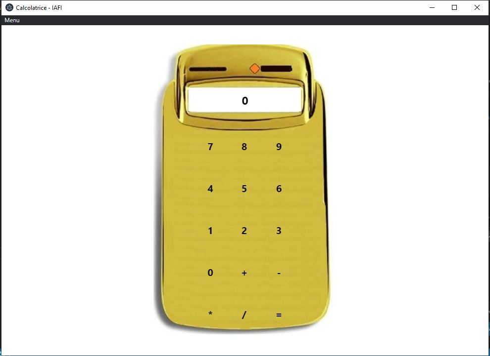

# electron-calculator
<h3>Un pomeriggio di quarantena 
  preso dalla noia e dalla voglia di scoprire electron...</h3>

<h2>Se hai Node.js e Npm</h2>
<h3>Puoi scaricare make.sh e eseguirlo nella shell</h3>
<h3>Il progetto verrà buildato ed eseguito</h3>
